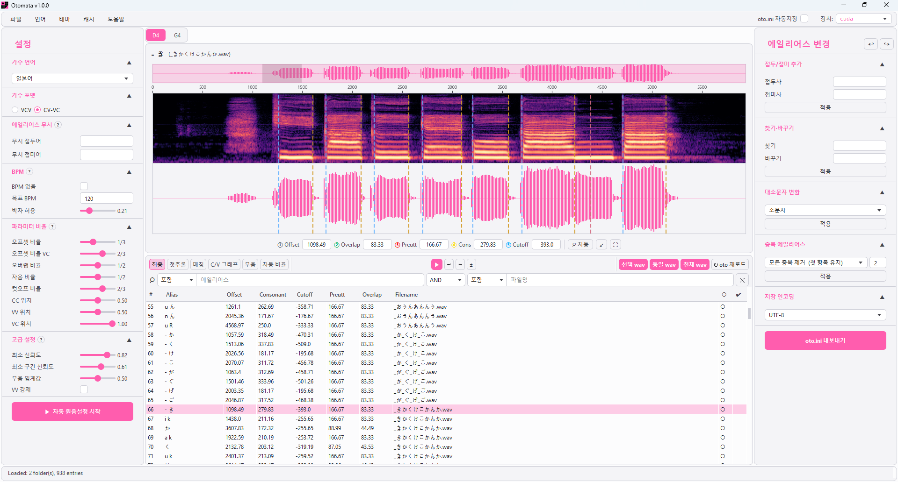

  

UTAU 보이스뱅크 **자동 원음설정(oto.ini)** 프로그램 — AI 기반 경계 검출로 oto.ini를 자동 생성합니다.

AI-powered automatic oto.ini generator for UTAU voicebanks.

> 🧪 **베타 버전입니다.** 오류가 있을 수 있으며, 피드백은 앱 내 *도움말 → 의견 보내기 / 버그 신고*로 보내주세요.

  

## 다운로드 / Download

👉 **[Releases](../../releases)** 페이지에서 최신 설치파일을 받으세요.

| 파일 | 대상 |
|---|---|
| `Otomata-x.x.x-Setup-GPU.exe` + `-GPU-1.bin` + `-GPU-2.bin` | **NVIDIA GPU** 사용자 (CUDA 가속, 용량 큼) |
| `Otomata-x.x.x-Setup-CPU.exe` | GPU가 없거나 NVIDIA가 아닌 경우 (용량 작음) |

어느 것을 받을지 모르겠다면 → **CPU 버전**을 받으세요. 어느 버전이든 기능은 동일하며, GPU 버전은 추론 속도만 빠릅니다.

> **GPU 버전 설치:** 용량 제한 때문에 파일이 3개로 나뉘어 있습니다.
> `Setup-GPU.exe`, `Setup-GPU-1.bin`, `Setup-GPU-2.bin` **세 파일을 모두 받아 같은 폴더에 둔 뒤** `Setup-GPU.exe`를 실행하면 자동으로 합쳐져 설치됩니다.
>
> **GPU install:** the GPU installer is split into 3 files due to size limits. Download **all three** into the same folder, then run `Setup-GPU.exe`.

**파일이 큰 이유:** Otomata는 설치 후 아무것도 추가로 내려받지 않도록 AI 추론 모델과 실행에 필요한 모든 구성요소(ONNX Runtime, Python 런타임, Qt 라이브러리)를 내장합니다. GPU 버전은 여기에 CUDA·cuDNN 라이브러리(이것만 수 GB)까지 동봉해 CUDA를 따로 설치할 필요가 없게 했고, 그래서 용량이 커져 3개 파일로 나눠 배포합니다.

*Why so large: the AI model and the full runtime (ONNX Runtime, Python, Qt) are bundled so the app works offline out of the box; the GPU build also bundles the CUDA/cuDNN libraries so you don't have to install CUDA yourself.*

### ⚠ Windows SmartScreen 경고가 뜨는 경우

베타 버전은 코드 서명이 없어 설치 시 파란색 SmartScreen 경고가 뜰 수 있습니다.
**「추가 정보」 → 「실행」** 을 누르면 설치가 진행됩니다.

If Windows SmartScreen appears, click **"More info" → "Run anyway"**.

## 시스템 요구사항 / Requirements

- Windows 10 / 11 (64-bit)
- GPU 버전: NVIDIA GPU (CUDA 12 지원 드라이버)

## 주요 기능 / Features

- 한국어(CV-VC / VCV) · 일본어(CV-VC / VCV) 보이스뱅크 자동 원음설정
- 스펙트로그램 + 경계 시각 편집
- BPM 기반 / BPM 없는 녹음 모두 지원
- oto.ini 내보내기 · 자동저장 · 편집 상태(oto.omt) 보존

## AI 사용 고지 / AI Disclosure

이 프로그램의 코드 일부는 **AI(Claude)와 함께 제작**되었습니다.
AI가 작성한 코드를 피하고 싶으신 분들을 위해 미리 알려드리며,
사실관계를 정확히 밝히기 위해 크레딧에도 Claude를 포함했습니다.

Parts of this program were developed together with AI (Claude).
This notice is provided in advance for those who prefer to avoid AI-written code,
and Claude is listed in the credits for the sake of accuracy.

## 크레딧 / Credits

- 제작: [@matax2bi](https://x.com/matax2bi)
- 데이터 기여: 혜성 [@comet_UTAU](https://x.com/comet_UTAU)
- 개발 협업: Claude (Anthropic)
- Built with PySide6 · librosa · matplotlib · ONNX Runtime

## 라이선스 / License

Otomata는 **독점(proprietary) 소프트웨어**입니다. 개인·상업적 사용은 자유이며, 프로그램으로 만든 결과물(oto.ini, 보이스뱅크 등)은 상업적으로 이용할 수 있습니다. 다만 프로그램의 수정·역공학·재배포는 금지됩니다. 자세한 내용은 [LICENSE.md](LICENSE.md)를 참고하세요.

Otomata is proprietary software — free for personal and commercial **use** (your output is yours), but modification, reverse engineering, and redistribution are prohibited. See [LICENSE.md](LICENSE.md).
