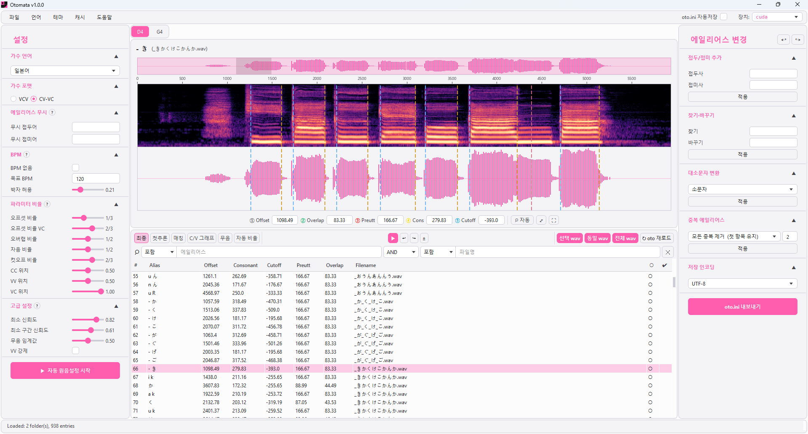

  

UTAU 음원의 **원음설정(oto.ini)을 AI 로 자동 배치**하는 Windows 프로그램입니다.
파일명으로 에일리어스를 만들고, 녹음을 듣고 음소 경계를 찾아 몇 분 만에 초안을 완성합니다.

AI-powered oto.ini tool for Japanese and Korean UTAU voicebanks.
*(English below is machine-translated from Korean.)*

**홈페이지 · 구매: [otomata.app](https://otomata.app)** · 소식: [@otomata_lab](https://x.com/otomata_lab)

  

## 가격 / Pricing

프로그램은 **무료**입니다. 음원 불러오기 · 보기 · 재생 · 직접 편집 · oto.ini 내보내기 · LAB 편집은 키 없이 됩니다.
**라이선스 키**가 있으면 AI 자동 원음설정이 열립니다.

- **출시 기념가 ₩30,000** (2026년 12월 31일까지 · 이후 정가 ₩50,000) — 1회 구매, 구독 아님
- 키 하나로 PC 3대 · 업데이트 평생 무료 · 만든 원음설정과 음원은 상업적 이용 자유
- 구매 · 환불 규정: [otomata.app](https://otomata.app) · [이용약관](https://otomata.app/terms.html)

*The app is free. A license key (one-time ₩30,000 launch price until Dec 31, 2026, then ₩50,000) unlocks AI Auto Otoing — up to 3 PCs, free updates for life. Buy at [otomata.app](https://otomata.app/?lang=en).*

## 다운로드 / Download

**[Releases](../../releases/latest)** 에서 받으세요.

| 파일 | 대상 |
|---|---|
| `Otomata-x.x.x-Setup-GPU.exe` + `-GPU-1.bin` + `-GPU-2.bin` | **NVIDIA GPU** 사용자 (CUDA 가속, 약 2.5 GB) |
| `Otomata-x.x.x-Setup-CPU.exe` | GPU가 없거나 NVIDIA가 아닌 경우 (약 660 MB) |

어느 것을 받을지 모르겠다면 → **CPU 판**을 받으세요. 결과는 같고 GPU 판은 속도만 빠릅니다.

> **GPU 판 설치:** 용량 제한 때문에 파일이 3개로 나뉘어 있습니다. **세 파일을 모두 같은 폴더에 받은 뒤** `Setup-GPU.exe`를 실행하세요.
>
> *GPU edition: download **all three files** into the same folder, then run `Setup-GPU.exe`.*

설치한 뒤에는 앱이 새 버전을 알려 주고, 바뀐 파일만 받아 업데이트합니다.
*After installation the app checks for updates and installs them for you.*

**파일이 큰 이유:** 설치 뒤 아무것도 더 내려받지 않도록 AI 모델과 실행 구성 요소(ONNX Runtime, Python 런타임, Qt)를 모두 넣었습니다. GPU 판은 CUDA · cuDNN 라이브러리까지 넣어 CUDA 를 따로 설치할 필요가 없습니다.

### ⚠ 'Windows의 PC 보호' 창이 뜨는 경우

코드 서명이 없어 처음 설치할 때 파란 SmartScreen 창이 뜰 수 있습니다. **「추가 정보」 → 「실행」** 을 누르세요.
*If "Windows protected your PC" appears, click **More info → Run anyway**.*

## 키 등록 / Activating your key

1. 결제하면 라이선스 키가 메일로 옵니다.
2. 앱의 **도움말 → 라이선스… → 키 입력…** 에 붙여 넣습니다(처음 한 번 인터넷 연결 필요, 이후 오프라인 사용).
3. 다른 PC 로 옮길 때는 같은 창에서 이 PC 를 해제하세요.

*Paste the key from your receipt e-mail in **Help → License… → Enter key…** (internet needed once).*

## 사용 환경 / Requirements

- Windows 10 / 11 (64-bit)
- GPU 판: NVIDIA 그래픽카드 + CUDA 12 지원 드라이버

## 주요 기능 / Features

- 파일명으로 에일리어스 자동 생성 — 일본어 CV-VC · VCV(가나 · 로마자), 한국어 CV-VC · CVC · 연속음(VCV)
- AI 경계 추론으로 오프셋 · 오버랩 · 선행발성 · 자음부 · 블랭크 자동 배치(전체 · 고른 파일 · 같은 wav 만 다시)
- 스펙트로그램 · 파형 위에서 마커를 끌어 편집, 실행 취소 · 단축키
- 표준 oto.ini 읽기 · 쓰기, 편집 상태(.omt)로 이어서 작업, BPM 있는 / 없는 녹음 모두 지원
- LAB 모드 — .lab 음소 경계 보기 · 직접 편집
- 수동 모드(모델을 올리지 않고 편집만), 자동 업데이트
- 화면 언어: 한국어 · 日本語 · English (일본어 · 영어는 기계 번역)

*Alias generation from file names, AI placement of all oto parameters, waveform/spectrogram editor, standard oto.ini I/O, LAB editor, manual mode and automatic updates.*

## AI 사용 고지 / AI Disclosure

- **AI 모델:** 자동 원음설정은 음소 경계를 찾는 AI 모델이 합니다. 이 모델은 개발자 본인 데이터, 서면 동의를 받은 데이터 제공자의 녹음 · 라벨, 이용이 허락된 공개 학습용 데이터로 학습했으며, 웹에서 무단으로 모은 데이터는 쓰지 않았습니다. 목소리를 만들거나 흉내 내지 않으며, 사용자의 녹음은 PC 밖으로 나가지 않습니다.
- **코드:** 이 프로그램의 코드 일부는 **AI(Claude)와 함께 제작**되었습니다. AI가 작성한 코드를 피하고 싶으신 분들을 위해 미리 알려드리며, 사실관계를 정확히 밝히기 위해 크레딧에도 Claude를 포함했습니다.

*The Auto Otoing model was trained on the developer's own data, recordings and labels contributed with written consent, and public datasets licensed for AI training — no data scraped from the web. It does not generate or imitate voices, and your recordings never leave your PC. Parts of the program's code were developed together with AI (Claude); this is disclosed in advance for those who prefer to avoid AI-written code, and Claude is listed in the credits.*

## 크레딧 / Credits

- 제작: 새온 (Saeon) · [@otomata_lab](https://x.com/otomata_lab) · 개발자 [@matax2bi](https://x.com/matax2bi)
- 데이터 기여: 혜성 [@comet_UTAU](https://x.com/comet_UTAU) 외 데이터 제공자 여러분
- 개발 협업: Claude (Anthropic)
- Built with PySide6 · librosa · matplotlib · ONNX Runtime

## 라이선스 / License

Otomata는 **독점(proprietary) 소프트웨어**입니다. 프로그램으로 만든 결과물(oto.ini, 음원 등)은 사용자의 것이며 상업적으로 이용할 수 있습니다. 프로그램의 수정 · 역설계 · 재배포와 키 공유는 금지됩니다. 자세한 내용은 [LICENSE.md](LICENSE.md)와 [이용약관](https://otomata.app/terms.html)을 참고하세요.

*Otomata is proprietary software. Your output is yours and may be used commercially; modifying, reverse engineering or redistributing the program and sharing keys are prohibited. See [LICENSE.md](LICENSE.md) and the [Terms of Use](https://otomata.app/terms.html).*

문의 / Contact: contact@otomata.app
